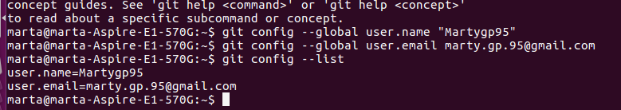

# Exercici 1.1.

## Creació de perfil de github + repositori

El meu perfil és Martygp95, amb adreça de correu electrònic marty.gp.95@gmail.com .

S’ha configurat en el git a partir de les comandes git config –global user.name  i  git config --global user.mail. S’ha comprovat que es guarda aquesta configuració a partir de la comanda git config --list.

Primer s’ha creat el repositori remot ‘Exercici’ a la pàgina de GitHub, el qual es clona el repositori, creant un repositori local a la nostra màquina amb la comanda git clone https://github.com/Martygp95/Exercici.git

## Modificació d'arxius (README.md i File 1)

En el repositori remot s’ha creat l’arxiu README.md, el qual s’ha pogut modificar en el repositori local; un cop modificat l’arxiu README.md, es posa aquest arxiu en seguiment a partir de la comanda git add , i posteriorment s’ha guardat al repositori amb la comanda git commit -m. La -m permet afegir un comentari sobre les modificacions que hem implementat en l’arxiu.

També s’ha creat un arxiu de text anomenat File1.txt en el repositori local, el qual s’ha guardat de la mateixa manera al repositori remot (que el README.md). 

A partir de la comanda git status es pot determinar quins arxius del repositori no es troben en seguiment i quins arxius que es troben en seguiment han sofert una modificació. Quan s’executa la comanda git add, el git crea una imatge en aquell mateix instant, la qual cosa provoca que es guardi l’arxiu tal i com està en aquell moment. En el cas de fer més modificacions s’hauria de tornar a executar la comanda git add.

Quan no hi ha cap arxiu que s’ha modificat ni cap arxiu fora de seguiment dins del repositori, surt de la manera següent:

Un cop es modifica algun arxiu, surt de la manera següent:

Un cop s’executa la comanda git add, l’arxiu sortirà de color verd, indicant que està preparat per al commit.

## Guardar canvis al repositori

Per tal de guardar els canvis en el repositori remot, simplement s’ha d’executar la comanda git push, seguit del nom del repositori remot (en aquest cas origin) i del nom de la branca (master).

## Creació de branques

Actualment en el repositori remot només tenim la branca master. Es pot observar a partir de la comanda git branch. Amb aquesta comanda també es pot visualitzar, en color verd, la branca en la qual estem treballant.

Per tal de crear una branca nova simplement s’ha de fer amb la mateixa comanda (git branch) i s’escriu el nom de la branca que es vol crear , en aquest cas branca1.

Amb la comanda git checkout es pot canviar de branca de treball. Canviant la branca de treball, ens permetrà fer commits en aquesta branca, de manera que tindrem certes modificacions que només es guardaràn en aquesta branca, sense afectar al contingut de la branca master.

